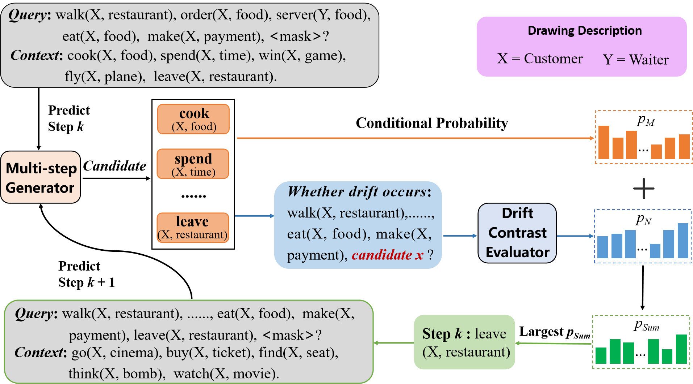

<h1 align="center">
  ELM
</h1>

<h4 align="center">A Evaluation-based Large Model for Multi-step Behavior Prediction in Intelligent Consumer Electronics</h4>

<h2 align="center">
  Overview of ELM
  
</h2>
This repository includes the source code of the paper accepted by xxxxxx. 

[//]: # ([**"A Evaluation-based Large Model for Multi-step Behavior Prediction in Intelligent Consumer Electronics".**]&#40;https://arxiv.org/abs/2209.07299&#41;)

### Dependencies

- Dependencies can be installed using `requirements.txt`.

### Dataset:

- We use NYT, icew14, icew15 and finance dataset for event prediction.
### Pretrained Checkpoint:
The 1-step prediction results are:

| Dataset |  NYT   | ICEWS14 | ICEWS15 | Finance | 
|:-------:|:------:|:-------:|:-------:|:-------:|
|  INSEP  | 81.37% | 81.52%  | 86.75%  | 79.15%  | 

The 2-step prediction results are:

| Dataset |  H@1   |  H@3   |  H@10  |
|:-------:|:------:|:------:|:------:|
|   NYT   | 72.56% | 93.90% | 97.27% |
| ICEWS14 | 73.31% | 93.64% | 95.55% |
| ICEWS15 | 79.53% | 91.37% | 96.07% |
| Finance | 70.21% | 91.56% | 95.18% |

The 3-step prediction results are:

| Dataset |  H@1   |  H@3   |  H@10  |
|:-------:|:------:|:------:|:------:|
|   NYT   | 62.60% | 88.98% | 96.01% |
| ICEWS14 | 62.17% | 88.33% | 96.45% |
| ICEWS15 | 67.54% | 85.13% | 95.52% |
| Finance | 60.42% | 87.13% | 95.54% |

The 4-step prediction results are:

| Dataset |  H@1   |  H@3   |  H@10  |
|:-------:|:------:|:------:|:------:|
|   NYT   | 53.09% | 84.16% | 94.89% |
| ICEWS14 | 52.94% | 85.63% | 94.76% |
| ICEWS15 | 52.77% | 87.27% | 95.37% |
| Finance | 53.55% | 84.76% | 94.54% |


### Training and testing:

- Install all the requirements from `./requirements.txt.`
- Commands for reproducing the reported results:
  ##### (1)  Evaluator
  python Evaluator.py 
- epoch=20
- lamda=15
- skip_n_val_epoch:train_model->1000; test_model->0
  
  ##### (2)  Generator
  python Generator.py 
- epoch=60
- lamda=15
- skip_n_val_epoch:train_model->1000; test_model->0


### Citation

If you used our work or found it helpful, please use the following citation:
```
@inproceedings{MuScb,
    title = "Perceiving the Distant Future: A Multi-Step Prediction Method for Consumer Behavior",
    author = "Li, Jinpeng and
      Yu, Hang  and
      Wei, Subo 
    booktitle = "xxxxxx",
}
```
